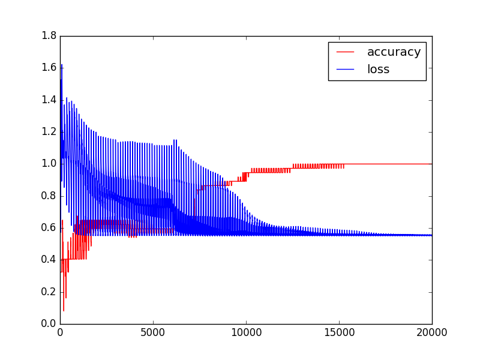

### about project
a tensorflow-based neural network with 3 layers (1 hidden layer) classifies the wines to three classes.

### dependencies
* python(2.7)
* tensorflow
* matplotlib

### how to run
```python
cd 03_wine
./wine.py
```
then the program will print the training process including accuracy and loss, ending with a graph like this:


### parameter
* hidden layer: 1
* hidden layer neuron: 13
* learning rate start: 0.01
* batch size: 5
* train loop: 20000


### author
wangdan

### date
2017/05/22
